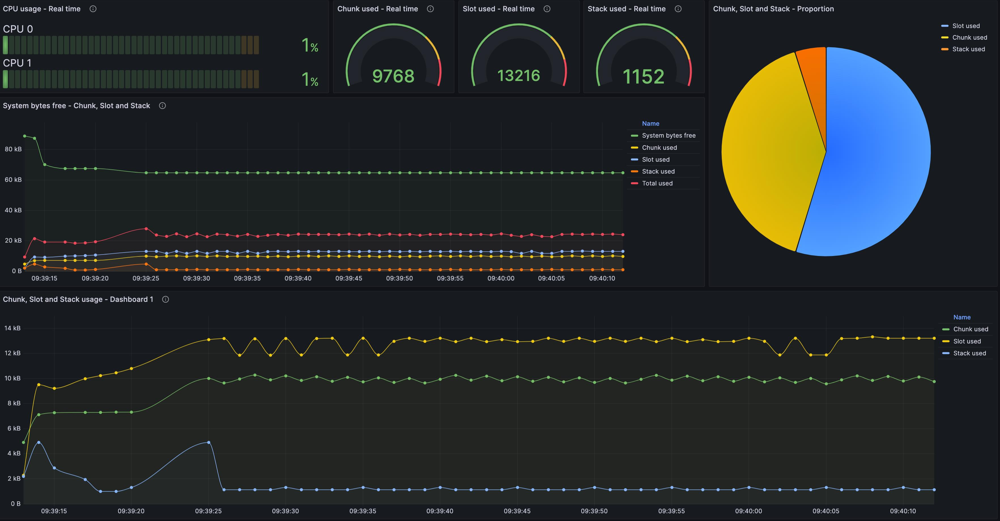

# Moddable Instrumentation Parser



## Overview

Moddable Instrumentation Parser is a Python script designed to parse log files generated by Moddable instrumentation and organize the extracted data into separate CSV files for a "worker" and "controller" virtual machine.

The CSV files are the input files for the Grafana to generate dashboards for the instrumentation data analysis, such as CPU usage, chunks, slots, stack, etc.

## Table of Contents

- [Description](#description)
- [Installation](#installation)
- [Usage](#usage)
- [Dependencies](#dependencies)
- [Author](#author)
- [License](#license)

## Description

This script processes log files containing instrumented data from Moddable and extracts relevant information related to "instruments." It categorizes the data into two components: "worker" and "controller." The parsed information is then written to separate CSV files for further analysis.

## Installation

1. Clone the repository:

   ```bash
   git clone https://github.com/costa-victor/moddable-instrumentation-parser.git
   ```
2. Navigate to the repository:

   ```bash
   cd moddable-instrumentation-parser
   ```
3. Update the input file path and output file paths in the script (`log_processor.py`) according to your requirements.
4. Install [Grafana](https://grafana.com/)
5. Install [Grafana CSV plugin](https://grafana.com/grafana/plugins/marcusolsson-csv-datasource/)
6. Install [moreutils](https://rentes.github.io/unix/utilities/2015/07/27/moreutils-package/)
7. Import the Grafana example dashboard: [Moddable instrumentation analysis.json](grafana_dashboard/Moddable%20instrumentation%20analysis.json)

## Usage

1. Run the following command in the terminal to generate the logs to be consumed by the script:

   ```bash
   mcconfig -i -m -p esp32/nodemcu | ts %s >> your-log.log
   ```
2. In a second terminal, run the script:

   ```bash
   python log_processor.py
   ```

   This will process the log file, extract relevant information, and write the results to CSV files.

## Dependencies

- Python 3
- Grafana
- Grafana CSV - Plugin
- moreutils

## Author

- Victor Alberti Costa

## License

This project is licensed under the MIT License - see the [LICENSE](LICENSE) file for details.
